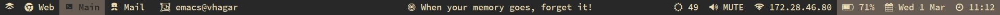

# go-lemonbar
Lemonbar Configuration via Go.



Looks and feels inspired by [@CopperBadger's Config](https://github.com/CopperBadger/dotfiles/tree/master/dots/.i3/lemonbar-new)

Completely Modular. Each module runs in its own goroutine and handles
click signals as well as workspace switching and updates automatically
in certain time intervals.

Requires:

* `lemonbar-xft` - Taken from AUR
* `go`

Install Using:

```
go install
```

Current Modules:

* DateModule - For Current Date and Time. Simplest Module which serves as a template for other modules.

  

* BatteryModule - For Battery Status. Uses Fontawesome icons and requires:
  `github.com/distatus/battery` - Easily Installed via `go get -u github.com/distatus/battery`
  
  

* BrightnessModule - For Brightness Value. Uses `/sys/class/backlight/intel-backlight`

  

* IpModule - Finds currently active network interface using `net` package

  

* WorkspaceModule - For communicating with i3 and maintaining currentWorkspace. Requires:
  `github.com/proxypoke/i3ipc` - Easily Installed via `go get -u github.com/proxypoke/i3ipc`

  

* ShellModule - For those of us who can't get over our shell scripts :stuck_out_tongue: 

  

# TODO:

* Read all configuration from config file instead of hardcoding into code.
